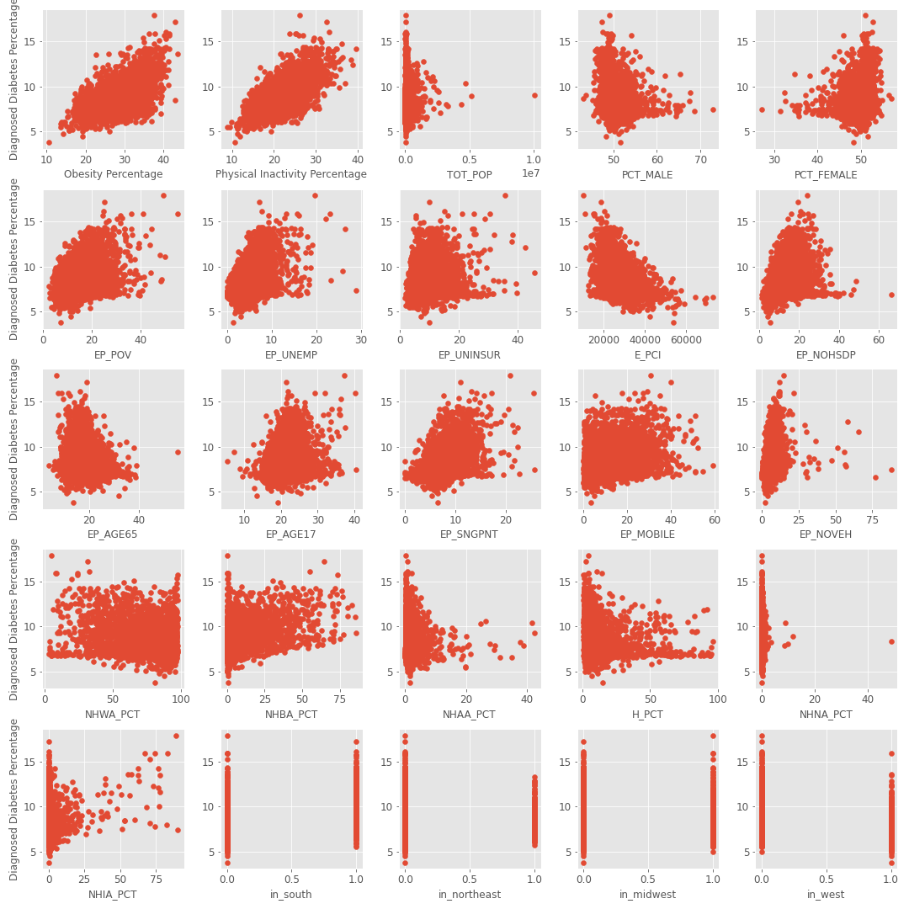
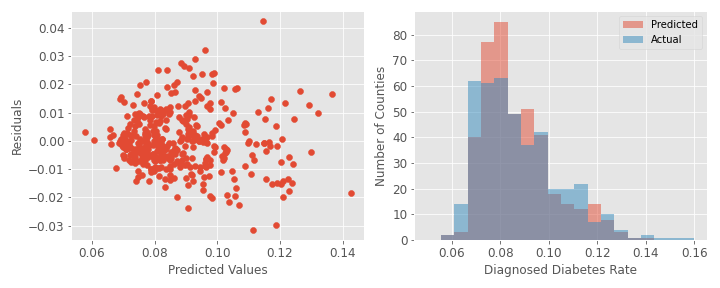
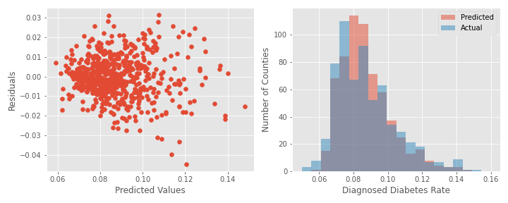

# predicting-diabetes-rates

Diabetes affects over 30 million Americans (~10% of the population). Moreso than many diseases, diabetes is linked to lifestyle choices, diet, and exercise. These lifestyle factors, and thus diabetes rates, are likely related to socioeconomic status, geographic region, and other factors. To better understand the factors that influence diabetes rates, I will analyze data on diabetes rates, socioeconomic factors, and demographics accross all counties in the United States. I will attempt to fit a model that can predict diabetes rates for US counties. Such a tool, if it were sufficiently accurate, could be used to inform counties of the number of cases they should expect, which could be used to estimate healthcare costs, and might also provide some indication of whether diabetes is underdiagnosed in a particular county.  

### Data Sources

Intro statistics:
https://www.diabetes.org/resources/statistics/statistics-about-diabetes

Diabetes/obesity/physical activity rates: https://gis.cdc.gov/grasp/diabetes/DiabetesAtlas.html#

Socioeconomic data: https://www.atsdr.cdc.gov/placeandhealth/svi/data_documentation_download.html

Race/Demographics: https://www2.census.gov/programs-surveys/popest/datasets/2010-2019/counties/asrh/cc-est2019-alldata.csv

### Importing Data

After downloading, all datasets were cleaned and joined on state/county name in the python file import_data.py. See file for documentation on cleaning and joining datasets.

Final dataframe before feature selection: 

This dataframe has 3141 rows (2 fewer than the total number of counties in the US due to missing data), and 273 columns/features. These features include many reduntant features from the socioeconomic dataset, and very granular racial demographics. Before doing any in depth EDA or modeling, I needed to select a subset of the columns. 

Feature selection/engineering was performed in the python file select_features.py

Exploratory data analysis and model testing was performed in the notebook Diabetes-feature-selection-and-EDA.ipynb

## Exploratory Data Analysis

First, lets look at the overall distribution of diabetes rates in US counties:

Mean: 8.7% 
Standard Deviation: 1.8%

We can see that diabetes rates vary over a large range, with some counties as low as ~4%, and others as high as ~18%, with the bulk of the counties falling between about 6-12%. Interestingly, we don't have symmetrical distribution - the peak is at about 7%, and there is a standard bell curve fall off to the right, but a much sharper drop to the left. That is, very few counties have less than ~7% diabetes. Ultimately this looks more like a Poisson distribution than a normal distribution - this will be important later.

Lets take a look at the counties with the highest and lowest diabetes rates:

Interesting - it looks like southern and midwest counties make up the bulk of the top 15 counties, while western counties make up the bulk of the bottom 15. Let's see whether that pattern is maintained over the full dataset:

Again, we see more blue and now some purple toward the left, indicating that western and northeastern counties have lower diabetes rates, while we see more red to the right, indicating that southern counties have higher diabetes rates. Gray (midwestern) counties are sprinkled fairly uniformly throughout.

## Feature selection for modeling

Now let's explore our other features and how they relate to diagnosed diabetes percentage. I selected 25 features to use in the analysis. These include two health-related features (obesity percentage and physical inactivity percentage), 8 socioeconomic factors (percent poverty, percent unemployed, percent with no high school diploma, etc.), total population, 10 demographic factors (including racial groups, age groups, and male/female split), and dummy variables indicating the region (south, midwest, northeast, west). For all racial demographics I aggregated male and female totals and calculated a percent of total population. 
 
As a first pass to explore these variables we can plot all variables against diagnosed diabetes percentage: 

From this plot, we can see some variables that are likely to be useful. Obesity percentage and physical inactivity percentage correlate fairly well with diabetes rates. To a lesser degree, we can see correlations for EP_POV (the percentage of people living in below the poverty line), EP_UNEMP (percentage unemployed), EP_NOHSDP (percentage with no high school diploma), and E_PCI (estimated per capita income, a negative correlation in this case).  

The 4th row of the plot (and the first plot of the 5th row) features various racial demographics. It is much less clear whether any of these will be useful in the regression. There does seem to be a very slight negative correlation with NHWA_PCT (non-hispanic white alone percent) and a slight positive correlation with NHBA_PCT (non-hispanic black alone percent), so these may be worth including. There is a fairly strong positive correlation with NHIA_PCT (non-hispanic american indian and alaskan native percent), however a fairly low number of counties have a high percentage.

In the bottom row, we see the same pattern for regions as we saw in the bar graphs above. Lower diabetes percentages in the northeast and west, and higher diabetes percentages in the south and midwest. 

Now that we have some sense of our variables, lets start testing some models!

# Modeling Diabetes Rates

Our first step is to split the data into test and train sets. I did an 80:20 Train:Test split. From here on, until we have a final model, we will be working exlusively with the training set, and saving the final test set for the end. From this point on, when I refer to a training set, it will really be training set within this initial training set.

## Baseline Model

First, we will generate a "dumb" model to serve as a baseline to compare to our other models. Our dumb model will be to simply use the mean of our diabetes rates as an estimate.

### Mean of Training Set = 0.087 (8.7% diabetes)

## Baseline model error

We will use root mean squared error (RMSE) as our error metric. A function to calculate RMSE is in the python file error.py

### Baseline error = 0.0177

Perhaps a more fair comparison is to use KFold cross validation, even on this simple model. We will do so with a K of 6.

## Real baseline error = 0.018

Because we are using RMSE, we can actually interpret this value. On average, our predicted values differ from our real values by about 0.018, or 1.8 percent (remember, we are predicting a percentage). This might not sound bad, but recall that most of our values fall within 1-2% of the mean: 

As a matter of fact, our RMSE for our dumb model is ~equal to our sample standard deviation (1.8%), as we should expect for a model that just uses the mean.

# Simple Linear Regression

Let's build in complexity towards our final model. The next most basic approach is to use a simple linear regression. 

To start, lets use a model with just the two health factors (obesity and physical activity) and see how we perform. 

Remember, these variables correlate reasonably well with diabetes rates: 

A function to test models with kfolds is in the python file test.py

Plot for one of the folds:

Average RMSE: 0.0123

Great, we have improved slightly over our 'dumb' model from 0.018 to 0.012 (about 2/3 of the initial error). However, we can see from our predicted vs. actual histogram that our predicted values take on a normal distribution while our actual values look more like poisson. Lets try a poisson regression!

Average RMSE: 0.0121

Okay, so we are only very slightly better, but the distribution does look slightly more similar, so we will stick with this regressor. 

# Selecting our top features

Instead of going through all features manually, lets try to optimize. We can write a function that tests all single features, chooses the feature that gives the lowest error score, and adds that to the list of features to use. This can be found in test.py under the function name add_features. We can loop this process, sequentially adding more features and always choosing the feature that gives the lowest error.

## What are our top features?

This plot displays the error as we add features. For example, the fourth row (+ Obesity Percentage) is the error when we use Physical Inactivity Percentage, EP_UNEMP, and Obesity Percentage. 

How many should we use?

At around 7 features we begin to get diminishing returns. This seems like a good number of features to have an interpretable model that is not overfit.

How do our residuals and predictions look with this model?

Average RMSE: 0.0103

The model has improved from 1.21% to 1.03% RMSE, and the distribution of the predictions looks much more like the poisson distribution of the actual values. 

## What can we learn from this model? 

Our best predictors of diabetes percentage (according to a poisson regression) are:
1. Physical Inactivity Percentage
2. Estimated Percent Unemployed
3. Obesity Percentage
4. Non-hispanic black alone percentage
5. In south (dummy variable)
6. Non-hispanic american indian and alaskan native percentage
7. Estimated per capita income

So these are likely factors that have a real relationship with diabetes. 

# More complex models:

For the scope of this project, the above model will serve as the main model from which I will draw conclusions; however, for the sake of comparison, I will do a quick test of a few more complex models to see how they perform relative to the poisson regression.

## Random Forest

Random forest with max_features set to 10 (2/5 of our total features):

Average RMSE: 0.0102 

This model performs just slightly better than our poisson regressor (RMSE 0.0102 vs 0.0103) despite using all 25 features compared to the poisson regressor's 7. The costs of using this more complex model easily outway the benefits for our purposes, given that it is much harder to interpret. 

## Lasso

Lasso model with a range of alphas:

Minimum RMSE: 0.0104 

A lasso using all features hits a minimum RMSE score of 0.0104, which is worse than the poisson regression. This makes some sense, as the poisson regression uses the appropriate distribution while lasso is expecting a normal distribution. A model that combines the two (poisson distribution with lasso) might work better, but that is out of the scope of this project. 

## Ridge

Ridge model with a range of alphas:

Minimum RMSE: 0.0104

Similar to the lasso, even using all 25 features and an optimal alpha, the ridge does not perform as well as the poisson. It suffers from the same problem - expecting a normal distribution when the target is poisson. 

# Final model

Final model testing is in the jupyter notebook Final_Model.ipynb

Using the training and test sets generated at the beginning of the project, we can test the final poisson model

## Model: PoissonRegressor, alpha = 0
## Features used: 
1. Physical Inactivity Percentage
2. Estimated Percent Unemployed
3. Obesity Percentage
4. Non-hispanic black alone percentage
5. In south (dummy variable)
6. Non-hispanic american indian and alaskan native percentage
7. Estimated per capita income

## Performance:

Baseline(mean) model RMSE: 0.0175

Final model RMSE: 0.0104

# Conclusions:

My exploratory data analysis generated some interesting conclusions. I found that diabetes rates varied in US counties from below 4% to above 17%, and that most of the counties with the worst (highest) diabetes rates were in the south (with some in the midwest), while most of the counties with the best rates were in the west. This can perhaps be explained by differences in lifestyle and socioeconomics. However, as I found at the modeling phase, simply being in the south was the 5th most powerful predictor of diabetes rates, even though the model also included socioeconomic and lifestyle factors. Perhaps other differences in the south - like diet - that were not included in this dataset can account for this variable's predictive power.

In the modeling phase, I found that a poisson regression was the best model for this dataset. This makes sense given that I was predicting a proportion. I found that more complex models like random forest, ridge, and lasso did not perform substantially better than the regression on this dataset. 

By iterating through all features and adding the best features to the model one-by-one, I was able to determine the most useful features in predicting diabetes rates. I was surprised to find that physical inactivity - not obesity - was the most important factor, and even more surprised to find that percent unemployment was ahead of obesity as well. 

Interestingly, per capita income was only 7th most important, while unemployment was 2nd, implying that your diabetes risk is affected more by having a job at all than by making a lot of money.

## Future directions:

- More lifestyle features

    - More granular information on diet and exercise

- Political leanings
    - Are liberals or conservatives at higher risk?

- More model optimization and feature engineering
    - maybe some features would have worked better if they were transformed in some way.

- How universal is this model?
    - for example, could a model like this (with some tweaks) predict diabetes rates in Canada? Europe? etc. 

- Predicting a more useful variable related to diabetes, like diabetes associated healthcare costs. 

# Bonus:

I didn't have time to incorporate dimension reduction into any of my models, but I did run PCA and get some interesting plots. This PCA did not include diabetes rates or region data, because that data was used after the fact to color the markers.:

While the first two principal components did not separte the counties into clear clusters, they did do a decent job of moving counties with higher diabetes rates to the right (and lower to the left). The first two components also sort of clustered counties by region. This is interesting given that there was no geographic or diabetes information in the actual dimension reduction process. 
